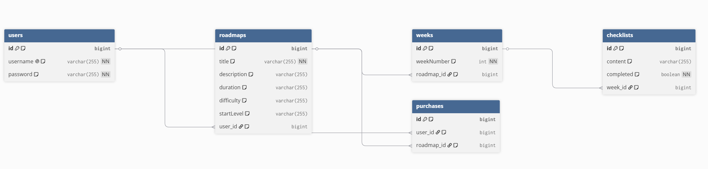

# 📚 Roadmap Service - 백엔드 API 서버

학습 로드맵을 생성, 검색, 구매하고 진도를 관리하는 서비스의 백엔드 API 서버입니다.

---

## 🛠 기술 스택

| 항목 | 내용 |
|------|------|
| Language | Java 17 |
| Framework | Spring Boot 4.0.6 |
| Database | MySQL 8.0 |
| ORM | Spring Data JPA / Hibernate |
| Security | Spring Security |
| Build Tool | Gradle |

---

## 📁 프로젝트 구조

```
src/
└── main/
    ├── java/
    │   └── com/roadmap/service/
    │       ├── config/                  # 설정 파일
    │       │   ├── CorsConfig.java      # CORS 설정
    │       │   └── SecurityConfig.java  # Spring Security 설정
    │       │
    │       ├── controller/              # API 요청 처리
    │       │   ├── AuthController.java      # 로그인/회원가입
    │       │   ├── RoadmapController.java   # 로드맵 CRUD
    │       │   └── PurchaseController.java  # 구매 및 체크리스트
    │       │
    │       ├── service/                 # 비즈니스 로직
    │       │   ├── AuthService.java         # 인증 로직
    │       │   ├── RoadmapService.java      # 로드맵 로직
    │       │   ├── ChecklistService.java    # 체크리스트 로직
    │       │   └── PurchaseService.java     # 구매 로직
    │       │
    │       ├── repository/              # DB 접근
    │       │   ├── UserRepository.java
    │       │   ├── RoadmapRepository.java
    │       │   ├── ChecklistRepository.java
    │       │   └── PurchaseRepository.java
    │       │
    │       ├── entity/                  # DB 테이블 매핑
    │       │   ├── User.java
    │       │   ├── Roadmap.java
    │       │   ├── Week.java
    │       │   ├── Checklist.java
    │       │   └── Purchase.java
    │       │
    │       └── dto/                     # 요청/응답 데이터
    │           ├── LoginRequest.java
    │           ├── RoadmapRequest.java
    │           └── RoadmapResponse.java
    │
    └── resources/
        ├── static/                      # 프론트엔드 파일
        └── application.properties       # 서버 설정
```

---

## 🗄 데이터베이스 구조

```
users          # 사용자
├── id
├── username
└── password

roadmaps       # 로드맵
├── id
├── title
├── description
├── duration
├── difficulty
├── startLevel
└── user_id (작성자)

weeks          # 주차
├── id
├── weekNumber
└── roadmap_id

checklists     # 체크리스트 항목
├── id
├── content
├── completed
└── week_id

purchases      # 구매 내역
├── id
├── user_id
└── roadmap_id
```

---

## 🔌 API 목록

### 인증 (Auth)

| 메서드 | 주소 | 설명 |
|--------|------|------|
| POST | `/api/v1/auth/register` | 회원가입 |
| POST | `/api/v1/auth/login` | 로그인 |
| GET | `/api/v1/users/me` | 내 정보 조회 |

#### 회원가입 요청 예시
```json
{
    "username": "testuser",
    "password": "1234"
}
```

#### 로그인 요청 예시
```json
{
    "username": "testuser",
    "password": "1234"
}
```

---

### 로드맵 (Roadmap)

| 메서드 | 주소 | 설명 |
|--------|------|------|
| GET | `/api/v1/roadmaps` | 전체 로드맵 조회 |
| GET | `/api/v1/roadmaps/search?keyword=` | 키워드 검색 |
| GET | `/api/v1/roadmaps/{id}` | 로드맵 상세 조회 |
| GET | `/api/v1/roadmaps/{id}/preview` | 로드맵 미리보기 (구매 전) |
| POST | `/api/v1/roadmaps` | 로드맵 생성 |
| PUT | `/api/v1/roadmaps/{id}` | 로드맵 수정 |
| DELETE | `/api/v1/roadmaps/{id}` | 로드맵 삭제 |

#### 로드맵 생성 요청 예시
```json
{
    "title": "ADsP 3주 단기합격",
    "description": "노베이스도 가능한 ADsP 합격 로드맵",
    "duration": "3주",
    "difficulty": "중상",
    "startLevel": "비전공자",
    "weeks": [
        {
            "weekNumber": 1,
            "checklists": ["1과목 강의 수강", "개념문제 풀기"]
        }
    ]
}
```

---

### 구매 (Purchase)

| 메서드 | 주소 | 설명 |
|--------|------|------|
| POST | `/api/v1/purchases` | 로드맵 구매 |
| GET | `/api/v1/purchases/check?roadmapId=` | 구매 여부 확인 |
| GET | `/api/v1/users/me/purchases` | 내 구매 목록 |

---

### 체크리스트 (Checklist)

| 메서드 | 주소 | 설명 |
|--------|------|------|
| GET | `/api/v1/roadmaps/{id}/checklists` | 체크리스트 조회 |
| PATCH | `/api/v1/checklists/{id}/progress` | 체크박스 상태 저장 |
| GET | `/api/v1/roadmaps/{id}/progress-rate` | 진도율 조회 |

---

## ⚙️ 실행 방법

### 1. MySQL 데이터베이스 생성
```sql
CREATE DATABASE roadmap_db;
```

### 2. application.properties 설정
```properties
spring.datasource.url=jdbc:mysql://localhost:3306/roadmap_db?useSSL=false&serverTimezone=Asia/Seoul&characterEncoding=UTF-8
spring.datasource.username=root
spring.datasource.password=본인_비밀번호
spring.datasource.driver-class-name=com.mysql.cj.jdbc.Driver

spring.jpa.hibernate.ddl-auto=update
spring.jpa.show-sql=true
spring.jpa.properties.hibernate.dialect=org.hibernate.dialect.MySQLDialect

server.port=8080
```

### 3. 서버 실행
IntelliJ에서 `RoadmapServiceApplication.java` 실행

### 4. 접속
```
http://localhost:8080
```

---

## 📌 참고사항

- 서버 실행 시 DB 테이블이 자동으로 생성됩니다
- 현재 로컬 환경에서만 실행 가능합니다
- 프론트엔드 파일은 `src/main/resources/static` 폴더에 위치합니다
